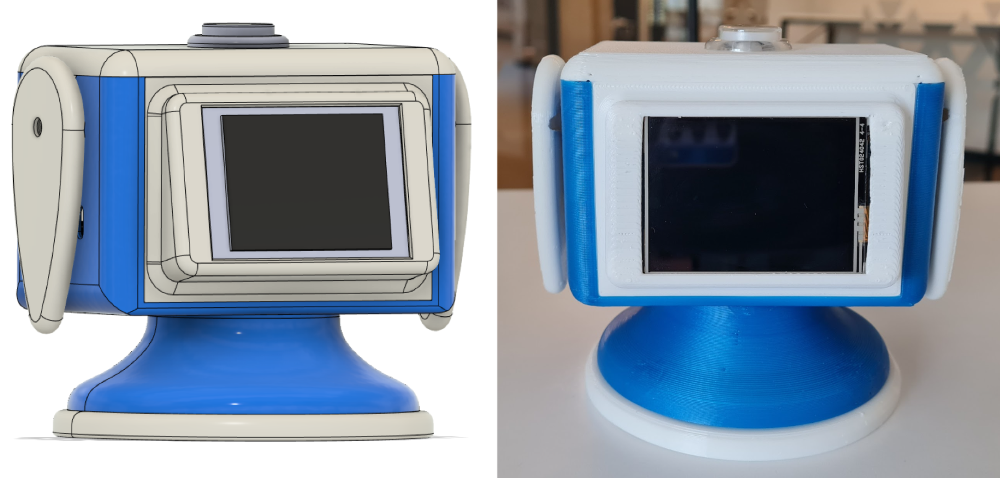

### MechDesign contains all CAD files and print-ready .3mf files  

+ `RSCv4_assembly v68.step` contains part assembly step files  
+ `RSCv4_assembly v68.f3z` contains part assembly with editable design features for use in Fusion360
+ `RSCv4_speaker_shroud.3mf` contains print-ready .3mf part models of the speaker shroud assembly
+ `RSCv4_front_back.3mf` contains print-ready .3mf part models of the front and rear panels
+ `RSCv4_base_lid_flipper.3mf` contains print-ready .3mf part models of the base, lid and flippers 
  
The RSC prototype is constructed using off-the-shelf components and features a portable, friendly hourglass shape design, standing at 11cm tall and weighing ~374g. 

To provide a comprehensive user experience, the RSC enables interaction through various modalities such as voice, gesture, tactile inputs, and incorporates visual, auditory, and motion indicators for enhanced expressiveness. 
It strikes a balance between cost and technical performance, making it affordable for educational institutions and students. 
With its sleek design and friendly appearance, the RSC can serve as an inviting and approachable study companion, offering academic support to students on their learning journey.

### Hardware 
* RaspberryPi 4 Model B 4GB RAM + 32 GB SD Card
* AIY Voice Bonnet version2 (microphone + speaker + LED Button)
* Neopixel Ring 16 x 5050 RGB LED
* SG90 Servo Motors (Qty: 2)
*  Nextion Enhanced NX3224T024 - Generic 2.4'' HMI 320*240 Touch Display
*  Logic Level Shifter 4-Channel, Bidirectional
